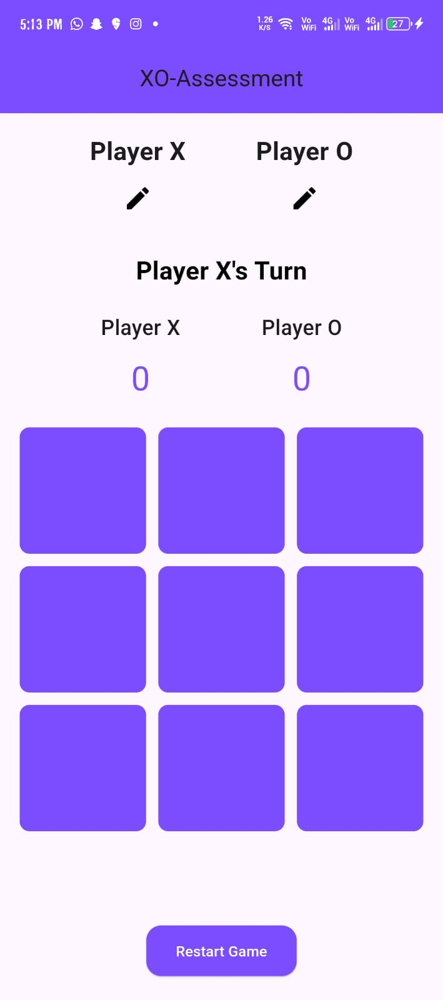
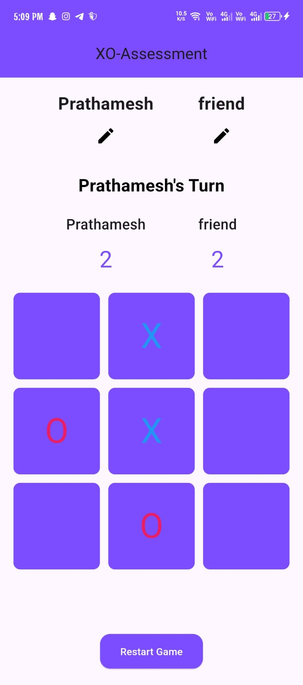
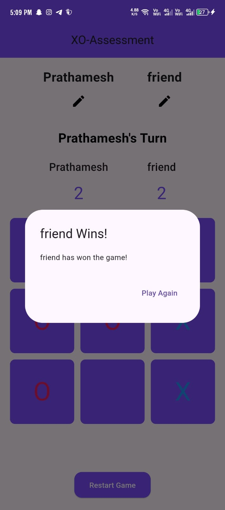

# XO-APP-ASSESSMENT

## Features

- **Player Customization**: Players can edit their names for 'X' and 'O'.
- **Turn Indicator**: Displays whose turn it is to play.
- **Score Tracking**: Keeps track of wins for both players.
- **Winner/Draw Dialog**: Shows a dialog when the game ends, indicating the winner or a draw.
- **Restart Functionality**: Allows players to restart the game at any time.

## Screenshots

### Main Screen


### Name Edit 



### Winner Dialog



## Installation

1. **Clone the Repository**:

   ```bash
   git clone https://github.com/your_username/tic_tac_toe_flutter.git
   cd tic_tac_toe_flutter
   flutter pub get
   flutter run
